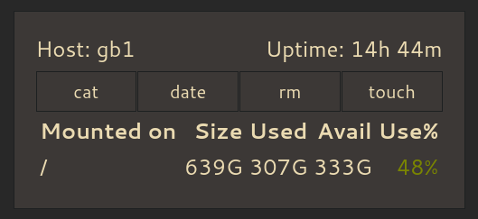

## Server dashboard



Writing this was easier than teaching my family to use ssh to shut down our media server.

### Quick start

```
go run . -config examples/config.toml
```

Open [http://localhost:8080](http://localhost:8080).

### Configuration

Example [configuration file](examples/config.toml).
